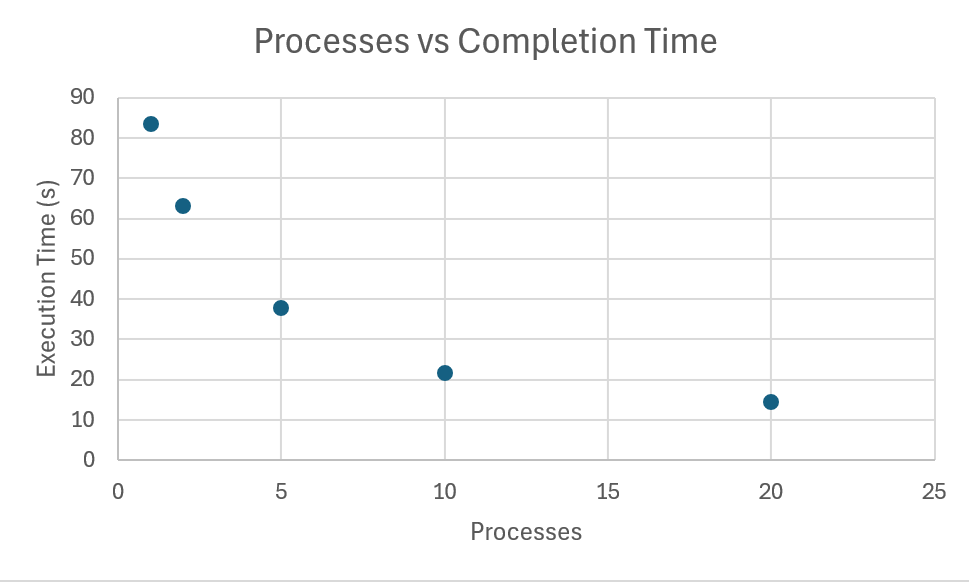

# System Programming Lab 11 Multiprocessing

## Implementation

This program takes an argument (-n) with a number that then controls how many processes are then used by the program to generate the 50 mandel images. The processes are created using the fork command in a for loop with each process being spawned off of the parent process.

## Benchmarking Results

Benchmarks were ran using the command line 'time' command. Values of 1, 2, 5, 10, and 20 were used to benchmark. The results are below.

| Processes | Time (s) |
|:----------|----------:|
| 1   | 83.391 |
| 2   | 63.196 |
| 5   | 37.828 |
| 10  | 21.703 |
| 20  | 14.347 |

The results show that as more processes are added the program completes faster, however the speedup evens out towards the end as we reach the number of logical processor in the device. If we were to add more than 20 we would see it even out or possibly e slower due to making more processes without additional device processors.
